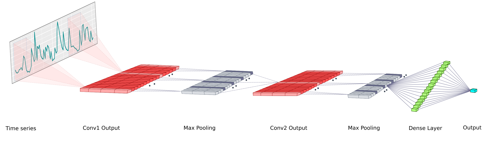
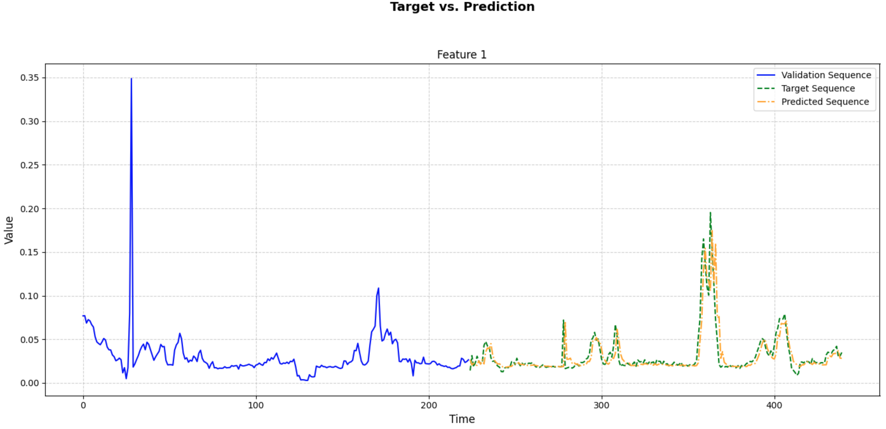
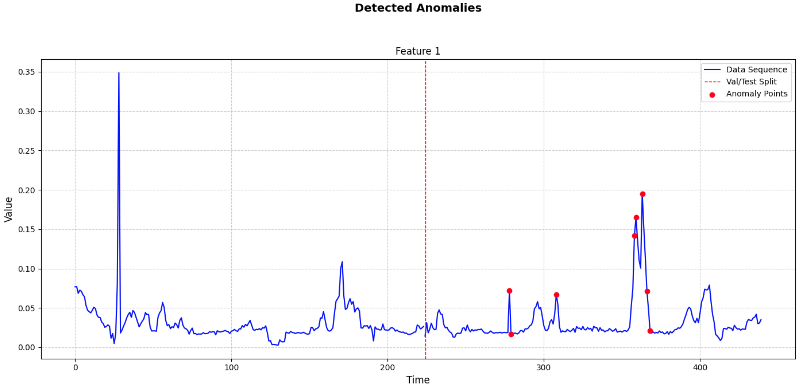

# DeepAnT: A Deep Learning Approach for Unsupervised Anomaly Detection in Time Series

This repository contains an implementation of the paper "DeepAnT: A Deep Learning Approach for Unsupervised Anomaly Detection in Time Series." The original paper can be found [here](https://ieeexplore.ieee.org/document/8581424).

## About the Paper

The paper, authored by Mohsin Munir, Shoaib Ahmed Siddiqui, Andreas Dengel, and Sheraz Ahmed, presents DeepAnT, a novel deep learning model designed for unsupervised anomaly detection in time series data. 

- **Model Structure**: 
The model consists of a sequence of convolutional layers followed by fully connected layers to capture local patterns and long-term dependencies. Below is the model structure from the paper:

- **Unsupervised Learning**: Suitable for applications with scarce labeled anomalies.
- **Anomaly Detection**: Detects anomalies by comparing predicted values with actual values and calculating anomaly scores.

## Implementation Details

This implementation follows the architecture and methodology described in the paper using PyTorch and PyTorch Lightning.

- **Sliding Window**: Preprocesses the time series data using a sliding window approach.
- **Forecasting-Based Model**: Predicts the next value(s) in the sequence for anomaly detection.
- **Training and Validation**: 
    - Initial training without considering the validation loss.
    - After the initial training, the best model is selected based on the validation loss, using early stopping to prevent overfitting.
- **Dynamic Threshold Calculation**: Threshold for anomaly detection procedure is dynamically calculated based on the anomaly scores' statistics.
- **Visualization**: Provides visualizations for predicted sequences as well as detected anomalies.

## Results

The model was trained and validated on the 1D NAB dataset. Below are key results from the training run:

### Training and Validation

- **Final Training Loss**: 0.0024
- **Final Validation Loss**: 0.0032

### Anomaly Detection

- **Dynamic Threshold**: 0.0276
- **Detected Anomalies**: Anomalies detected at indices [54, 55, 84, 132, 134, 135, 139, 141, 142, 144]

### Visualizations

The results of the model's predictions and anomaly detection are visualized as follows:




## Usage

1. **Clone the repository**:
    ```bash
    git clone https://github.com/EnsiyeTahaei/DeepAnT.git
    cd DeepAnT
    ```

2. **Install the required packages**:
    ```bash
    pip install -r requirements.txt
    ```

3. **Run the main script**:
    ```bash
    python main.py --dataset_name <dataset_name>
    ```

Note: dataset_name is optional. If not provided, it defaults to "NAB".

## License

This project is licensed under the MIT License.

## Citation

If you use this code for your research, please cite the original paper:

@ARTICLE{8581424,
  author={Munir, Mohsin and Siddiqui, Shoaib Ahmed and Dengel, Andreas and Ahmed, Sheraz},
  journal={IEEE Access}, 
  title={DeepAnT: A Deep Learning Approach for Unsupervised Anomaly Detection in Time Series}, 
  year={2019},
  volume={7},
  number={},
  pages={1991-2005},
  keywords={Anomaly detection;Time series analysis;Clustering algorithms;Data models;Benchmark testing;Heuristic algorithms;Anomaly detection;artificial intelligence;convolutional neural network;deep neural networks;recurrent neural networks;time series analysis},
  doi={10.1109/ACCESS.2018.2886457}
}
