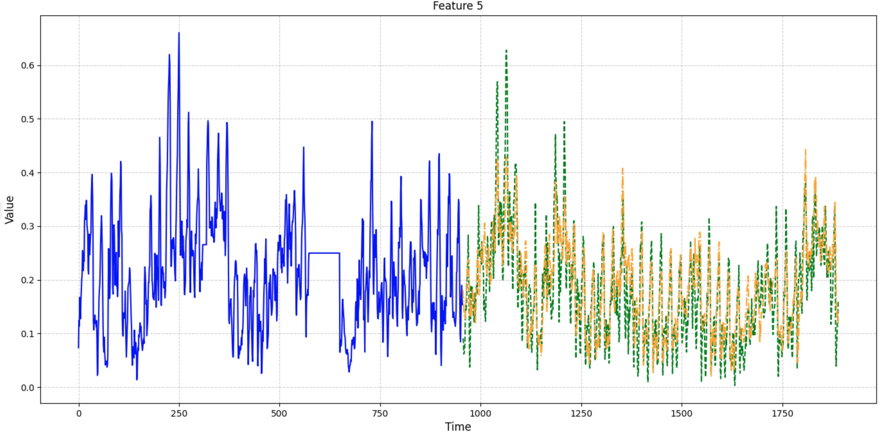
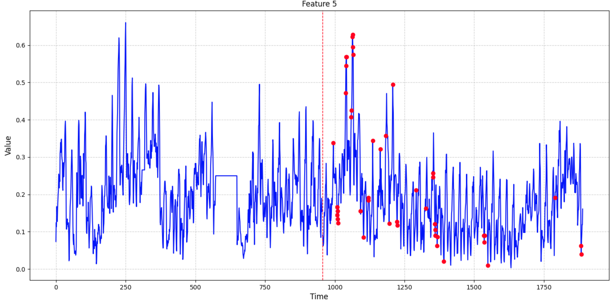

# DeepAnT: A Deep Learning Approach for Unsupervised Anomaly Detection in Time Series

This repository contains an implementation of the paper **"DeepAnT: A Deep Learning Approach for Unsupervised Anomaly Detection in Time Series."** The original paper can be found [here](https://ieeexplore.ieee.org/document/8581424).

## About the Paper

The paper, authored by Mohsin Munir, Shoaib Ahmed Siddiqui, Andreas Dengel, and Sheraz Ahmed, presents DeepAnT, a novel deep learning model designed for unsupervised anomaly detection in time series data. 

- **Model Structure**: 
The model consists of a sequence of convolutional layers followed by fully connected layers to capture local patterns and long-term dependencies. Below is the model structure from the paper:

- **Unsupervised Learning**: Suitable for applications with scarce labeled anomalies.
- **Anomaly Detection**: Detects anomalies by comparing predicted values with actual values and calculating anomaly scores.

## Implementation Details

This implementation follows the architecture and methodology described in the paper using PyTorch and PyTorch Lightning.

- **Sliding Window**: Preprocesses the time series data using a sliding window approach, converting raw sequences into overlapping windows (input) and the subsequent step (target).
- **Forecasting-Based Model**: Predicts the next value in the sequence. Anomalies are inferred by large deviations of the predicted value from the actual value.
- **Training and Validation**: 
    - Initial training without considering the validation loss.
    - After the initial training, the best model is selected based on the validation loss, using early stopping to prevent overfitting.
- **Dynamic Threshold Calculation**: Thresholds are computed per feature dimension based on the anomaly score distribution (mean ± N standard deviations).

- **Visualization**: Provides visualizations for predicted sequences as well as detected anomalies.

## Multivariate Support

This implementation now supports both **univariate** and **multivariate time series** datasets. When `feature_dim > 1`, it automatically:
- Calculates **per-feature** thresholds.  
- Identifies anomalies in each feature separately.  
- Creates subplots for each feature to show anomalies per feature dimension.

## Results

### Univariate NAB Dataset

Below is an example run on the **NAB** (univariate) dataset:

- **Final Training Loss**: `0.0022`  
- **Final Validation Loss**: `0.007`  
- **Dynamic Threshold**: `0.031`  
- **Detected Anomalies**: `[54, 55, 84, 134, 135, 139, 142, 144]`

<p float="left">   </p>


### Multivariate Air Quality Dataset


The model also was tested on the **Air Quality** dataset from the UCI Repository:

- **Number of Features**: `15` (Date, Time, CO, PT08.S1, PT08.S2, etc.)  
- **Window Size**: `24` (one day of hourly data)  
- **Final Training Loss**: `0.043`
- **Final Validation Loss**: `0.066`
- **Per-Feature Thresholds**: `[0.191, 0.003, 0.175, ...]`  
- **Detected Anomalies** (per feature):
  ```
  {
    "Feature_1": [16, 17, 54, 55, 56, 147, ...],
    "Feature_2": [427, 595, 643, 667, 673, ...],
    ...
  }
  ```

  An example visualization of one of its features:

<p float="left">   </p>

## Usage

1. **Clone the repository**:
    ```bash
    git clone https://github.com/EnsiyeTahaei/DeepAnT.git
    cd DeepAnT
    ```

2. **Install the required packages**:
    ```bash
    pip install -r requirements.txt
    ```

3. **Configure Dataset**:
    - Edit `config.yaml` to set `dataset_name`, `window_size`, and other hyperparameters. Currently, two datasets are configured:
        - NAB (for univariate)
        - Air Quality (for multivariate)

4. **Run the main script**:
    ```bash
    python main.py --dataset_name <dataset_name>
    ```

Note: `dataset_name` is optional. If not provided, it defaults to "Air Quality" (as it is specified in `config.yaml`).

## License

This project is licensed under the MIT License.

## Citation

If you use this code for your research, please cite the original paper:

@ARTICLE{8581424,
  author={Munir, Mohsin and Siddiqui, Shoaib Ahmed and Dengel, Andreas and Ahmed, Sheraz},
  journal={IEEE Access}, 
  title={DeepAnT: A Deep Learning Approach for Unsupervised Anomaly Detection in Time Series}, 
  year={2019},
  volume={7},
  number={},
  pages={1991-2005},
  keywords={Anomaly detection;Time series analysis;Clustering algorithms;Data models;Benchmark testing;Heuristic algorithms;Anomaly detection;artificial intelligence;convolutional neural network;deep neural networks;recurrent neural networks;time series analysis},
  doi={10.1109/ACCESS.2018.2886457}
}

## Questions or Contributions

Feel free to open an issue if you want to contribute further improvements.